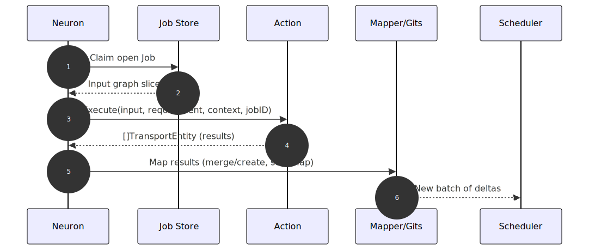

# Cyberbrain Diagrams (captions)

The following list contains all diagrams regarding cyberbrain inculding captions.

<!-- TOC -->
* [Overview](#overview)
* [Scheduling flow](#scheduling-flow)
* [Witness (idempotency)](#witness-idempotency)
* [Scheduler internals](#scheduler-internals)
* [Mapping flow](#mapping-flow)
* [Neuron execution](#neuron-execution)
* [Demultiplexing across alias slots](#demultiplexing-across-alias-slots)
<!-- TOC -->

## Overview
- File: diagrams/overview.svg
- Purpose: End-to-end flow from mapping deltas → scheduler → neurons → feedback into mapping.

[up](#cyberbrain-diagrams-captions)

## Scheduling flow
- File: diagrams/scheduling_flow.svg
- Purpose: Batch matcher pipeline — anchors → overlay expansion → filter relevance → strict causality → local witness → job creation.

[up](#cyberbrain-diagrams-captions)

## Witness (idempotency)
- File: diagrams/witness_flow.svg
- Purpose: Anchor-local Memory/Witness is used to deduplicate inputs without a global index.

[up](#cyberbrain-diagrams-captions)

## Scheduler internals
- File: diagrams/scheduler_internals.svg
- Purpose: Expanded view of overlay expansion, relevance/causality guards, and dedupe decision.

[up](#cyberbrain-diagrams-captions)

## Mapping flow
- File: diagrams/mapping_flow.svg
- Purpose: How the mapper upserts entities/relations and marks created/updated elements (bMap).

[up](#cyberbrain-diagrams-captions)

## Neuron execution
- File: diagrams/neuron_sequence.svg
- Purpose: A neuron claims a job, executes the action, maps results, and feeds new deltas back to the scheduler.

[up](#cyberbrain-diagrams-captions)

## Demultiplexing across alias slots
- File: diagrams/demux_slots.svg
- Purpose: Inputs are fanned out across alias slots (not per-type buckets); combinations are deep-copied and immutable.

[up](#cyberbrain-diagrams-captions)